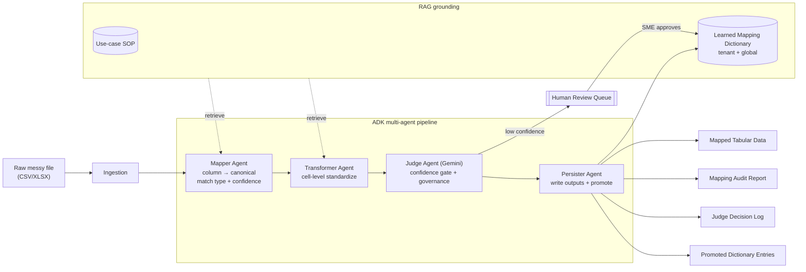
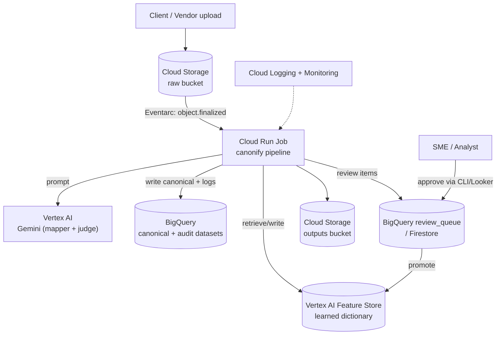
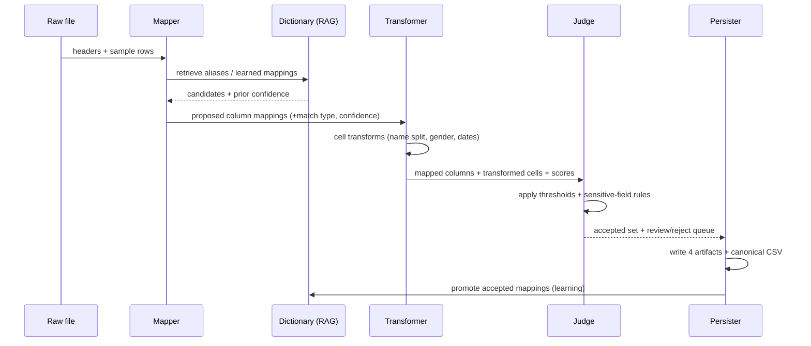

# Canonify Agent+ — Architecture

## 1. Design principles

1. **Interface-first, backend-swappable.** Every external capability (LLM, dictionary store, data
   sink) is behind a small Python interface with a **LOCAL** and a **GCP** implementation.
2. **Deterministic core, intelligent edges.** Rule-based matching is the reproducible baseline;
   Gemini adds semantic lift; the Judge guarantees governance regardless of backend.
3. **Everything is explainable and logged.** No decision without a rationale and a confidence score.
4. **Multi-tenant by construction.** The learned dictionary is namespaced by `tenant_id`, layered
   over a shared `global` namespace.

## 2. Logical architecture (agentic loop)



## 3. Physical architecture on GCP



## 4. Component responsibilities

| Component | LOCAL mode | GCP mode |
|---|---|---|
| **LLM** (`llm/gemini.py`) | Deterministic rule/fuzzy fallback | Vertex AI Gemini |
| **Dictionary** (`rag/dictionary.py`) | JSON file on disk | Vertex AI Feature Store |
| **SOP retrieval** (`rag/sop.py`) | Local markdown + keyword match | Vertex AI Vector Search over SOP docs |
| **Data sink** (`agents/persister.py`) | CSV + JSON files | BigQuery tables + GCS artifacts |
| **Orchestration** (`pipeline.py`) | In-process function calls | Cloud Run Job (same code) |
| **Trigger** | CLI invocation | Eventarc on GCS `object.finalized` |

## 5. Canonical data contract

The target schema is **data, not code** (`data/canonical_schema.yaml`). Adding Use Case 2 = adding a
new schema file — no engine changes. Each canonical field declares: `name`, `type`
(`string|date|categorical|number`), `required`, `sensitive`, `aliases`, and `enum` (for categoricals).

## 6. Confidence & governance model

```
score ≥ accept_threshold ............ AUTO-ACCEPT  (logged)
review_threshold ≤ score < accept ... REVIEW       (queued for SME)
score < review_threshold ............ REJECT       (queued, flagged)
sensitive field ..................... accept_threshold raised; inference always needs human confirm
```

Thresholds live in `data/canonical_schema.yaml` / `config.py`, so governance is tunable per tenant.

## 7. The four output artifacts (the contract with downstream)

1. `mapped_data.csv` — canonical tabular data.
2. `mapping_audit_report.json` — per-column: source(s), canonical, match type, confidence, rationale.
3. `judge_decision_log.json` — accept/review/reject verdicts + thresholds + reasons.
4. `promoted_dictionary_entries.json` — SME-approved mappings written back to the dictionary.

## 8. Data flow of a single file (sequence)


