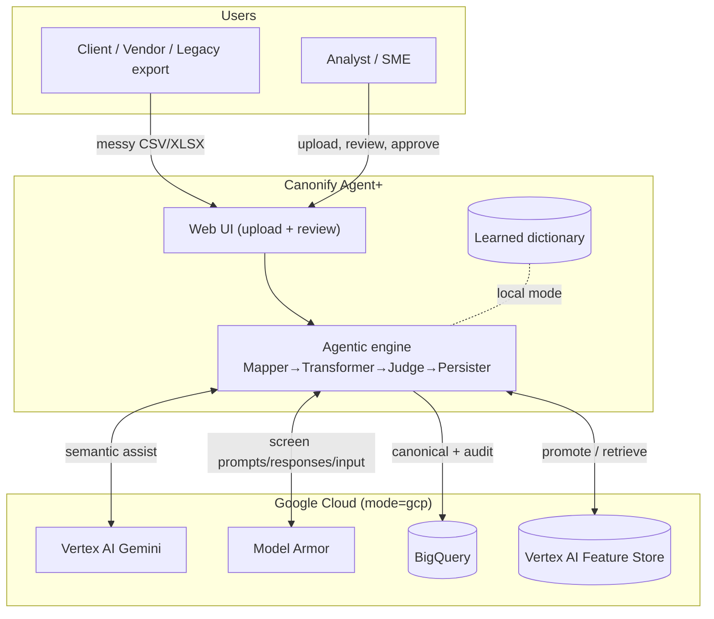
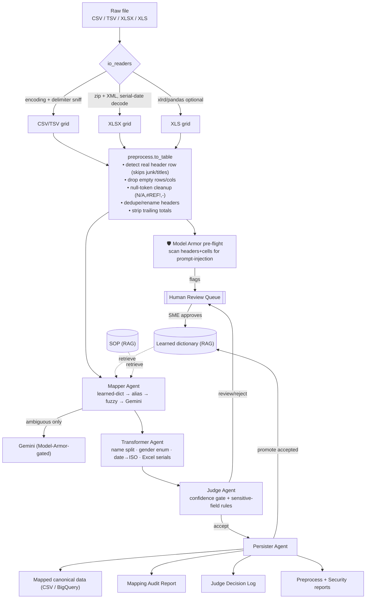
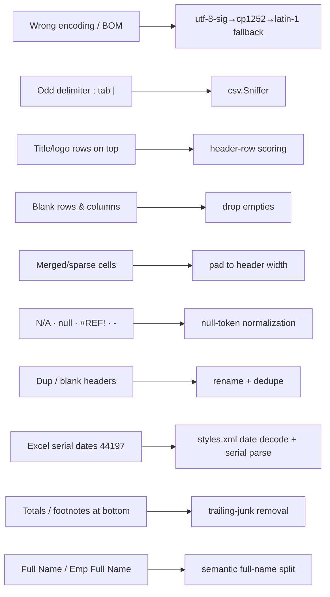
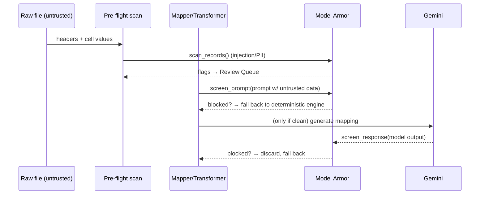
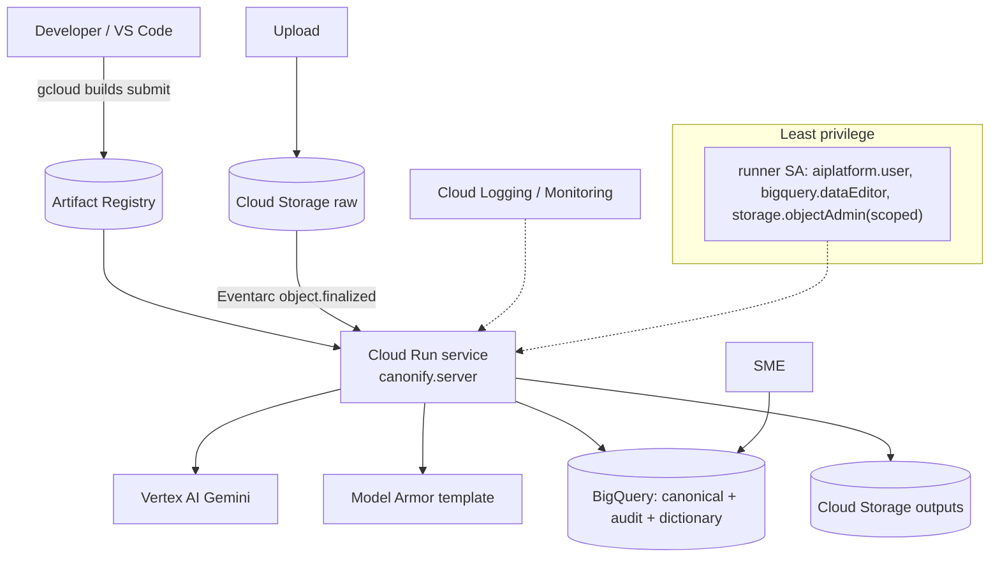

# Canonify Agent+ — Complete End-to-End Architecture

This is the full picture: from a user dropping the worst file imaginable, through robust ingestion,
the Model-Armor-protected agentic loop, to governed canonical data + a compounding learning loop.
All diagrams are Mermaid (render in VS Code with the *Markdown Preview Mermaid* extension, or on GitHub).

---

## 1. System context (who/what touches the system)

---

## 2. The complete request flow (worst-file → canonical)

---

## 3. "Worst-of-worst" data-robustness stages

What each stage defends against (all in `io_readers.py` + `preprocess.py`):

---

## 4. Security: Model Armor placement (defense in depth)

Untrusted file content reaches an LLM — so it is screened at **three** points.

---

## 5. Deployment (mode=gcp)

---

## 6. Local vs GCP — same code, swapped backends

| Concern | LOCAL (default) | GCP (`--mode gcp`) |
|---|---|---|
| File UI | `python -m canonify.webapp` (stdlib) | Same UI, or Eventarc-triggered `canonify.server` |
| Column intelligence | dict + alias + fuzzy | + Vertex AI Gemini |
| Security screening | regex heuristic (`model_armor.py`) | **GCP Model Armor** template |
| Learned dictionary | JSON on disk | BigQuery / Vertex AI Feature Store |
| Canonical + audit sink | CSV + JSON files | BigQuery tables + GCS |
| Trigger | CLI / web upload | Eventarc on GCS `object.finalized` |

The engine module boundary guarantees the local path never imports a cloud library.
